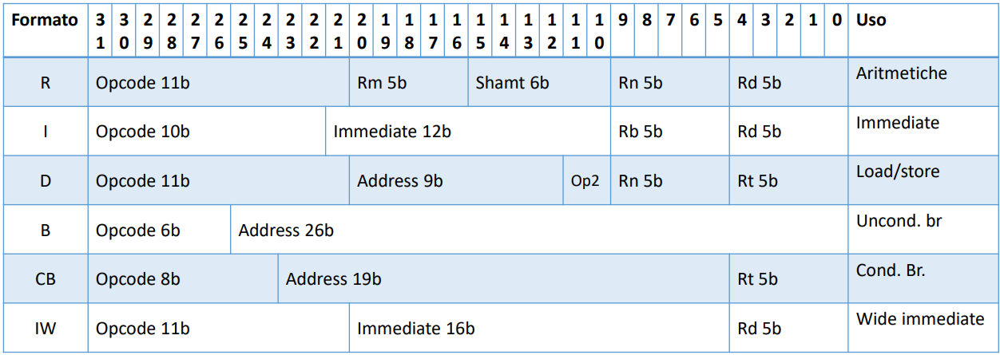
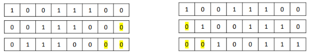
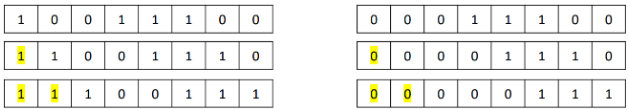

# Assembly
Gli appunti di questa repository hanno come unico scopo quello di essere un facile e veloce riassunto sui concetti principali della programmazione in assembly su architettura ARM. Lo studio diretto attraverso tali appunti è fortemente sconsigliato.

## Registri
- Ci sono **31 registri general purpose**
  - `X<n>` registri a 64bit
  - `W<n>` registri a 32bit (i meno significativi di `X<n>`)
  - `S<n>` registri floating point a 32bit
  - `D<n>` registri floating point a 64bit
- Il registro `XZR` contiene sempre il valore `0` e ignora le write
- Il registro `X28` o `SP` è usato come stack pointer
- Il registro `X29` o `FP` è usato come frame pointer
- Il registro `X30` è usato per memorizzare l’indirizzo di ritorno di una funzione, chiamato link register `LR`.

> **Nota**: Non si può utilizzare xzr come secondo operando. Al suo posto si utilizza MOV

> Nelle istruzioni, la scelta dei registri `X`, `W`, `V`, `S` o `D` determina la dimensione dell'operazione.

## Direttive assemblatore
- `.cpu` -> specifica il tipo di CPU
- `.text` -> indica la parte di codice da eseguire
- `.data` -> specifica le [variabili](#variables) salvate nell'Heap
  - `.float` -> inserisce un numero **float32**
  - `.ascii` -> inserisce una **stringa** (non terminata da 0)
  - `.asciiz`-> inserisce una **stringa** terminata da zero
  - `.byte` -> inserisce un **byte**
  - `.word` -> inserisce un numero **int32** (bisognerà usare i registri `w<n>`)
  - `.dword` -> inserisce un numero **int64** (bisognerà usare i registri `x<n>`)
  - `.space` -> riserva k bytes non inizializzati
- `.p2align 2` -> indica che gli indirizzi di memoria devono essere multipli di 2^2. Va specificato dopo `.text` e `.data`

## Instructions
**Formato delle istruzioni**:


### Memory Access Instructions
|Istruzione|Formato|Note|
|:-:|--|--|
|Load|`ldr <Rd>, [<Rn>]`|`<Rd> < MEM[<Rn>]`|
|Store|`str <Rd>, [<Rn>]`|`<Rd> > MEM[<Rn>]`|
|Address|`adr <Rd>, label`|Carica l'indirizzo di memoria in un registro (usato spesso con le variabili)|
|Swap|`swp Rd, Rm, [Rn]`|Swap Rm with location [Rn], [Rn] value placed in Rd|

> Note sull'istruzione `adr`: la label deve trovarsi entro 1MB del PC perchè l'indirizzo è specificato come offset dal PC. Con l'istruzione `ADPR` (stesso formato di `adr`) l'indice della pagina deve trovarsi entro 4GB dal PC.

### General data processing instructions
|Istruzione|Formato|Note|
|:-:|--|--|
|Add|`add <Rd>, <Rn>, <Operand2>`|`Rd = Rn + Operand2`|
|Sub|`sub <Rd>, <Rn>, <Operand2>`|`Rd = Rn - Operand2`|
|Multiply|`mul <Rd>, <Rn>, <Rs>`|`Rd = Rn * Rs`|
|And|`and <Rd>, <Rn>, <Operand2>`|`Rd = Rn && Operand2`|
|Or|`or <Rd>, <Rn>, <Operand2>`|`Rd = Rn \|\| Operand2`|
|Move|`mov <Rd>, <Rn>`|Copia il valore del secondo registro nel primo|
|Compare|`cmp <Rd>, <Rn>`|Compara due registri (usata per i salti condizionati)|

> **Note** sull'istruzione `cmp`: tale istruzione viene utilizzata quando abbiamo bisogno di comparare due registri per eventuali salti condizionati. Il risultato viene salvato automaticamente nel registro `APSR`.

> **Note** sull'istruzione `mov`: per usare immediati più grandi di 16bit si utilizza l'istruzione `MOVZ` (carica i bit e mette gli altri a zero) o 'MOVK' (carica i bit lasciando inalterati gli altri) shiftando le cifre a gruppi di 16bit le cifre.

### Barrel shifter
Shiftando un numero è possibile moltiplicare (shift a sinistra) o dividere (shift a destra) per potenze di 2.
Queste istruzioni vengono usate nel secondo operando (detto anche operando flessibile).

|Istruzione|Formato|Note|
|:-:|:-|--|
|LSL|`add <Rd>, <Rn>, <Operand2>, LSL #n`|Operand2 is the contents of `<Operand2>` multiplied by `#n`|
|LSR|`add <Rd>, <Rn>, <Operand2>`|Operand2 is the contents of `<Operand2>` divided by `#n`|
|ARS|`add <Rd>, <Rn>, <Operand2>, ASR #n`|Operand2 is the contents of `<Operand2>` divided by `#n`|

#### LSL & LSR
L'istruzione `lsl` (Logical Left Shift) e `lsr` (Logical Right Shift) vengono utilizzate per inserire degli zeri, rispettivamente a sinistra e a destra.



#### ARS
L'istruzione `ars` (Arithmetic Right Shift) inserisce 0 o 1 tenendo conto del segno.




### Branch instructions
#### Salti non condizionati
|Istruzione|Formato|Note|
|:-:|:-:|--|
|BL|`bl label`|The BL instruction copies the address of the next instruction into `r14` (lr, the link register), and causes a branch to label.|
|BR|`br Rm`|Salta all’indirizzo contenuto nel registro `Rm`|
|BLR|`blr Rm`|Salta all’indirizzo contenuto nel registro `Rm` e salva l’indirizzo dell’istruzione successiva nel registro `x30`.|

#### Salti condizionati semplici
|Istruzione|Formato|Note|
|--|--|--|
|CBZ|`cbz Rm, label`|Salta all’indirizzo label se `Rm` è **uguale a zero**|
|CBNZ|`cbnz Rm, label`|Salta all’indirizzo label se `Rm` è **diverso da zero**|

#### Salti condizionati
**Formato istruzione**: `b.<cond> label` 

Salta all'indirizzo label sulla base di una conditional mnemonics, descritti attraverso la tabella che segue:

|`<cond>`|Meaning|Flags|
|:-:|:-:|:-:|
|`eq`|Equal|`Z == 1`|
|`ne`|Not equal|`Z == 0`|
|`hs`|Higher or same (unsigned >=)|`C == 1`|
|`lo`|Lower (unsigned < )|`C == 0`|
|`mi`|Negative|`N == 1`|
|`pl`|Positive or zero|`N == 0`|
|`vs`|Overflow|`V == 1`|
|`vc`|No overflow|`V == 0`|
|`hi`|Higher (unsigned <=)|`C == 1 && Z == 0`|
|`ls`|Lower or same (unsigned <=)|`!(C == 1 && Z == 0)`|
|`ge`|Signed >=|`N == V`|
|`lt`|Signed <|`N != V`|
|`gt`|Signed >|`Z == 0 && N == V`|
|`le`|Signed <=|`|!(Z == 0 && N == V)`|
|`al`/`nv`|Always|Always|`true`|

>**Nota**: La colonna "Flags" indica i condition codes contenuti nel registro APSR (Application Program Status Register). N (se negativo), Z (se è zero), V (se c'è stato overflow) e C (se c'è stato un carry).

#### Conditional select
Conditional select, returning the first or second input.

**Formato istruzione**: `csel <Rd>, <Rn>, <Rm>, <cond>`

**Traduzione**:
```c
  if (<cond>) {
    <Rd> = <Rn>;
  } else {
    <Rd> = <Rm>;
  }
```

#### Conditional increment
Conditional select increment, returning the first input or incremented second input.

**Formato istruzione**: `csinc <Rd>, <Rn>, <Rm>, <cond>`

**Traduzione**:
```c
  if (<cond>) {
    <Rd> = <Rn>;
  } else {
    <Rd> = <Rm> + 1;
  }
```

### System call
**Formato istruzione**: `svc #n`

Attraverso questa operazione il controllo passa al Kernel che esegue una funzione particolare (syscall) in base al valore contenuto nel registro `x8`. Nella tabella sottostante sono ripotate alcune delle systemcall disponibili, la colonna "Numero" indica il valore che dovrà essere inserito nel registro `x8`.


| Numero | syscall name |  `x0` |  `x1` |  `x2` |  `x3` |  `x4` |  `x5` |
|:-:|:-:|:-:|:-:|:-:|:-:|:-:|:-:|
|   63   |     read     |`unsigned int fd`|`char* buf`|`size_t count`| | | |
|   64   |     write    |`unsigned int fd`|`const char *buf`|`size_t count`||||
|   93   |     exit     |`int error_code`	|   |      |   |       |

Una lista completa di tutte le System Calls è disponibile a questo [link](https://chromium.googlesource.com/chromiumos/docs/+/master/constants/syscalls.md#arm64-64_bit)

## Variables
Le variabili in Assembly vengono definite nella sezione `.data` specificando il nome e il tipo.

I **tipi** delle variabili possono essere i seguenti:
- `.float` -> inserisce un numero **float32**
- `.ascii` -> inserisce una **stringa** (non terminata da 0)
- `.asciiz`-> inserisce una **stringa** terminata da zero
- `.byte` -> inserisce un **byte**
- `.word` -> inserisce un numero **int32** (bisognerà usare i registri `w<n>`)
- `.dword` -> inserisce un numero **int64** (bisognerà usare i registri `x<n>`)
- `.space` -> riserva k bytes non inizializzati

**Esempio**:
```assembly
.data
.p2align 2

a:    .word -5, 10, 17, 100   //Array
b:    .word 20
c:    .word 0
str:  .ascii "Hi\n!"          //String di 3 Bytes         
```

**Nota**: Le variabili vengono salvate in memoria, per poterle utilizzare è necessario salvare l'indirizzo di memoria in un registro e successivamente (ed eventualmente) caricare il valore.

### Integers
*ATTENZIONE*: verificare il tipo di variabile, se usiamo un intero a 32Bit questo dovrà essere salvato in un registro `w<n>`, altrimenti se a 64Bit `x<n>`. In ogni caso l'indirizzo di memoria andrà salvato in un registro a 64Bit (`x<n>`).

```assembly
[...]
  //dove size è tipo .dword (64Bit, doppia precisione)
  adr x16, size    // x16 = &size (indirizzo di memoria)
  ldr x14, [x16]   // x14 < mem[x16]
[...]
```

## Constructs
### For
```c
for (int i = 0; i < 10; i++) {
  [...]
}
```

```assembly
cmp x2, #10   //x2 = i
b.ge exitfor  // >=

initfor:
  [...]
  
  add x2, x2, #1  //increment counter
  cmp x2, #10
  b.lt initfor

exitfor:
  mov x2, #0
```
### If - else
```c
  if (x <cond> y)
    [...]
  else 
    [...]
```

```assembly
  cmp x1, x2  //x1 = x, x2 = y
  b.<cond> elselabel
  
  [...]
  b exitlabel

  elselabel:
    [...]

  exitlabel:

```
### While, Do-While
```c
  do {
    [...]
  } while (x <cond> y);
```
```assembly
  initdo:
    [...]
    cmp x1, x2 //x1 = x, x2 = y
    b.<!cond> initdo
```

```c
  while (x <cond> y) {
    [...]
  }
```
```assembly

  cmp x1, x2 //x1 = x, x2 = y
  b.<!cond> exitwhile

  initwhile:
    [...]
    cmp x1, x2
    b.<cond> initwhile
  
  exitwhile:

```

## Functions
Per chiamare una procedura abbiamo bisogno d'interrompere il flusso d'istruzioni e dare il controllo al codice della procedura stessa. Al termine della procedura l’esecuzione deve riprendere all’istruzione successiva l’interruzione. 
Esiste un insieme di regole, Procedure Call Standard (PCS), che regola il passaggio di parametri e il ritorno:
- I **parametri** della funzione chiamata sono passati nei registri `x0`, ..., `x7`. Se la funzione accetta più di 8 parametri occorre usare lo Stack. 
- Il **valore di ritorno** di una funzione è passato nel registro `x0`.
- L’**indirizzo** alla **prossima istruzione** del codice chiamante è contenuto in `x30`, chiamato anche `LR`
- La funzione chiamata può utilizzare i **registri** `x0`, ..., `x15` senza preoccuparsi di preservarne il loro valore. E’ responsabilità del chiamante salvare il loro valore se necessario.
- La funzione chiamata deve preservare il valore dei **registri** `x1`, ..., `x27`. Significa che può modificarli, però prima di ritornare al chiamante (con RET) deve ripristinare il loro valore originario.
- Generalmente i **registri** `x8`,`x16`,`x17`,`x18` sono **riservati**.


**Esempio**:
```assembly
procedure:
  [...]
  ret   //Prima del ret ricordarsi di salvare in x0 il valore da ritornare

_start:
  [...]
  bl procedure
```

## Stack
Lo Stack è inizialmente allocato all’indirizzo `0x7FFFFFF2B0` e puntato dal registro `SP`.
Cresce e decrese quando viene aggiunto (push) o tolto (pop) un elemento.

Tutti gli accessi alla memoria effettuati mediante il registro `SP` devono essere allineati a 16 Bytes (gli indirizzi devono essere multipli di 16).

```assembly
          /* Primo modo, push e pop */

str w0, [SP, #-16]!				// push w0 
str w1, [SP, #-16]!				// push w1
str x2, [SP, #-16]!				// push x2

ldr x5, [SP], #16				// pop x5
ldr w4, [SP], #16				// pop w4
ldr w3, [SP], #16				// pop w3

          /* Secondo modo, push e pop */
//Decrementiamo manualmente SP
sub SP, SP, #16					// creiamo spazio per 16 bytes nello stack
str w0, [SP, #12]				// *(sp+12) = w0
str w1, [SP, #8]				// *(sp+8) = w1
str x2, [SP]					// *(sp) = x2

ldr x5, [SP]					// x5 = *(sp)
ldr w4, [SP, #8]				// w4 = *(sp+8)
ldr w3, [SP, #12]				// w3 = *(sp+12)
add SP, SP, #16					// togliamo lo spazio per i 16 bytes
```